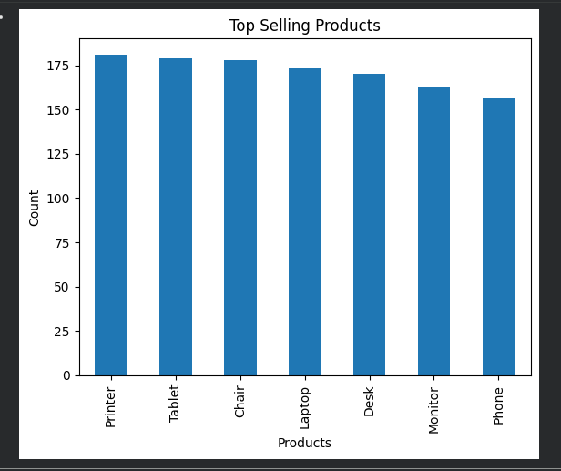
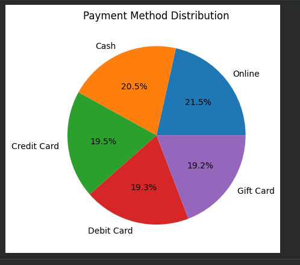
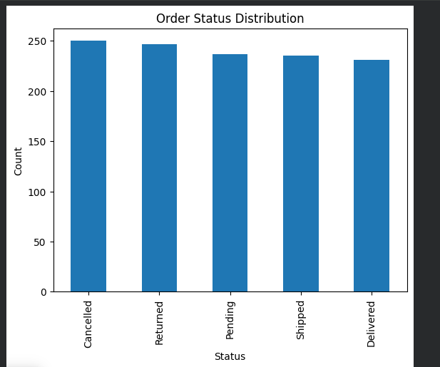

# DecodeLabs Week 1 - Data Cleaning and Exploratory Data Analysis Project

## Project Overview

This project was completed as part of the DecodeLabs Data Science Internship Program.

The objective of this project was to clean, analyze, and prepare raw data for further analysis by identifying data quality issues, handling inconsistencies, and exploring key patterns within the dataset.

## Objectives

* Load and inspect the dataset
* Identify and handle missing values
* Explore dataset structure and data types
* Clean and prepare data for analysis
* Generate visualizations to better understand the data
* Produce insights from the cleaned dataset

## Tools Used

* Python
* Jupyter Notebook
* Pandas
* Matplotlib
* Microsoft Excel

## Project Files

* Dataset for Data Analytics.xlsx
* Task_1_EddyB.ipynb
* dataset_preview.png
* data_cleaning_process.png
* final_dataset.png
* dataset_head.png
* dataset_info.png

## Skills Demonstrated

* Data Cleaning
* Exploratory Data Analysis (EDA)
* Data Validation
* Data Visualization
* Data Preparation
* Spreadsheet Analysis
* Problem Solving

## Project Screenshots

### Dataset Preview

### Data Cleaning Process

### Final Analysis

## Results

The dataset was successfully cleaned and prepared for analysis. Key steps included:

* Reviewing dataset structure and column information
* Identifying missing values
* Cleaning and validating records
* Exploring data distributions
* Creating visualizations to support analysis

The final dataset is ready for reporting and further analytical work.

## What I Learned

Through this project, I gained hands-on experience using Python and Pandas to clean and analyze data. I learned how to inspect datasets, identify potential data quality issues, prepare data for analysis, and create visualizations that communicate meaningful insights.

## Author

**Eddy Bartolome**

DecodeLabs Data Science Internship Program
